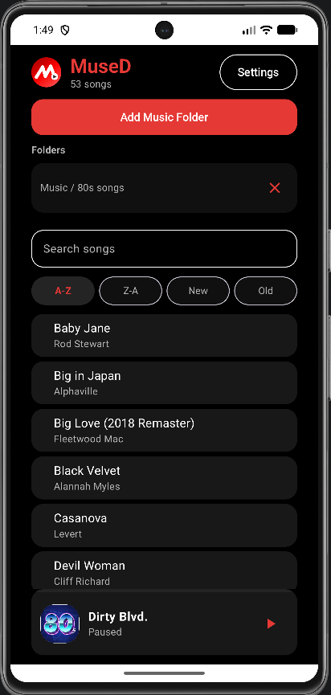

<p align="center">
  
</p>

# MuseD

**MuseD** is a modern offline Android music player focused on local music playback, background listening, persistent playback state, clean UI design, and a scalable Media3-based architecture.

Built entirely around local music libraries, MuseD provides a fast, privacy-friendly experience with no accounts, no cloud services, and no internet dependency.

---

## 🚀 Features

### Local Music Library

* Select music folders using Android's Storage Access Framework (SAF)
* Recursive folder scanning
* Multiple folder support
* Duplicate folder prevention
* Automatic library refresh after folder changes
* Fully offline music playback

### Library Management

* Song library with metadata support
* Search by:

    * Song title
    * Artist
    * Album
* Sort by:

    * Name A-Z
    * Name Z-A
    * Newest First
    * Oldest First
* Current playing song highlighting
* Cached library loading for faster startup
* Playback queue automatically follows the selected sort order
* Natural filename sorting support (1, 2, 3, 10, 11...)
* Consistent queue order across app restarts

### Playback

* Play / Pause
* Next / Previous
* Seek bar support
* Shuffle mode
* Repeat One
* Repeat All
* Queue-based playback
* Up Next queue view
* Tap queue item to instantly play
* Queue synchronization with library sorting
* Sort changes preserve the currently playing song and playback position


### Background Playback

* MediaSession integration
* Background playback
* Notification controls
* Lock screen controls
* Bluetooth media controls
* Audio focus support
* Automatic handling of audio disconnect events

### Playback Persistence

* Automatic playback state saving
* Current song restoration
* Playback position restoration
* Shuffle and repeat persistence
* Auto-resume after app restart
* Safe handling of missing or invalid files

### Album Art & Metadata

* Embedded album art extraction
* Album art displayed in:

    * Player screen
    * Mini player
    * Notifications
    * Lock screen
* Metadata extraction:

    * Title
    * Artist
    * Album
    * Duration
* Metadata caching
* Album art memory cache
* Album art disk cache

### Audio Features

* Equalizer support
* Presets:

    * Flat
    * Bass Boost
    * Vocal
    * Rock
    * Classical
* Persistent equalizer settings

### UI / UX

* Splash screen on application startup
* Jetpack Compose UI
* Modern Material 3 design
* Dynamic Material You theming
* OLED-friendly dark theme
* Mini player
* Responsive layouts
* Custom MuseD branding
* Consistent design system

### Privacy

* Offline-only architecture
* No accounts
* No analytics
* No tracking
* No cloud dependency
* User-selected folder access only

---

## 🛠 Tech Stack

* **Language:** Kotlin
* **UI:** Jetpack Compose
* **Playback:** Media3 / ExoPlayer
* **Background Audio:** MediaSessionService
* **Storage Access:** Storage Access Framework (SAF)
* **Architecture:** Repository Pattern + ViewModels
* **Preferences:** SharedPreferences
* **Platform:** Android

---

## 📁 Project Structure

```text
app/
├── features/
│   ├── folders/
│   ├── library/
│   ├── player/
│   ├── preferences/
│   └── repository/
│
├── ui/
│   ├── screens/
│   ├── components/
│   └── theme/
│
├── viewmodels/
│
└── models/

images/
Features.md
README.md
```

---

## 🧪 Development Notes

* Built entirely with Jetpack Compose
* Repository-based architecture
* Dedicated ViewModels for library, settings, and playback state
* MediaController abstraction for playback communication
* Album art memory and disk caching
* Optimized for large offline music libraries
* Stable playback queue management
* Persistent folder ordering across application restarts
* Focused on stability and maintainability

---

## 📌 Current Status

* Splash screen complete
* Local music playback complete
* Background playback complete
* Queue system complete
* Search system complete
* Album art support complete
* Equalizer support complete
* Dynamic themes complete
* Multi-folder support complete
* Playback queue sorting synchronization complete
* Architecture refactor complete
* Stabilization and release preparation phase

---

## 👤 Creator

Damir Bubanović

GitHub:
https://github.com/damir-bubanovic

---

## 🙌 Acknowledgments

Built with Kotlin, Jetpack Compose, Media3, ExoPlayer, and Android's Storage Access Framework.
